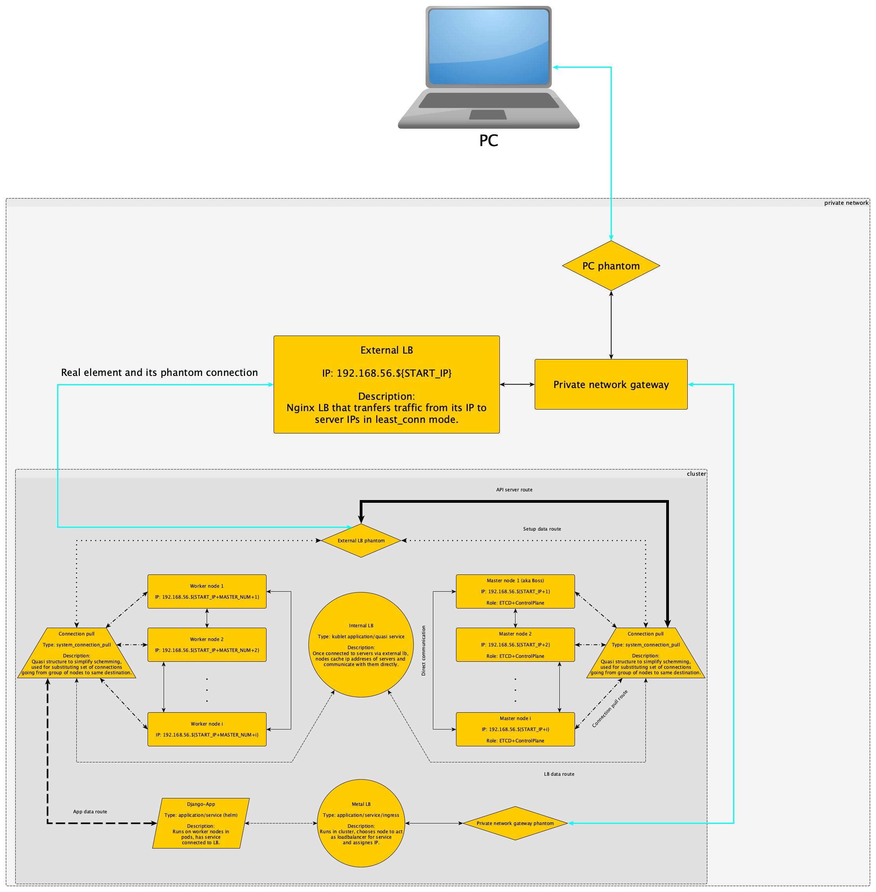

# K3S-HA-Vagrant

## [Part I DA Practice] K3S HA cluster with Vagrant




### Pre-requisites:

0. Download VirtualBox

<details>
<summary>Windows Hyper-V</summary>
<br>
To make VirtualBox vms function properly, you must disable Hyper-V and enable windows VMs 
(in Apps & Features > Optional Features > More optional Features) first
</details>

1. Install [Vagrant](https://www.vagrantup.com/downloads) and install vbguest plugin

```
vagrant plugin install vagrant-vbguest
```

2. (optional) Install [kubectl](https://kubernetes.io/docs/tasks/tools/)
3. (optional) Install [GIT](https://git-scm.com/downloads)


<details>
<summary><h3>Fast track</h3></summary>

0. Create directory where you want script to be stored
1. Open cmd as administrator (jic, as tested)
2. Navigate to directory, using `cd` and once you are there type

<pre>
git clone "<b>Paste_here_link_to_github_repo</b>" .
</pre>

3. Navigate to folder, that contains folder with stable version of K3S HA cluster on Vagrant (K3S-HA-Vagrant)
4. Type:

> :warning: **Make sure you have istalled [openssl](https://www.openssl.org)!** Mac users have openssl by default.

<pre>
<a href="./do_all" title="django dep">./K3S-HA-Vagrant/do_all</a> "<b>secret_password</b>"
</pre>

5. It is that easy - you are done
6. (optional) If to use kubectl from dev machine, copy config file at `"K3S-HA-Vagrant/configs/config"` to `$HOME/.kube/config` 
or use `KUBECONFIG` enviroment variable tostore path to config file
</details>


### Launching cluster:

0. Create directory where you want script to be stored
1. Open cmd as administrator (jic, as tested)
2. Navigate to directory, using `cd` and once you are there type

<pre>
git clone "<b>Paste_here_link_to_github_repo</b>" .
</pre>

3. Navigate to folder, that contains folder with stable version of K3S HA cluster on Vagrant (K3S-HA-Vagrant)
4. Type

```
vagrant up
```

5. It is that easy - you are done
6. (optional) If to use kubectl from dev machine, copy config file at `"K3S-HA-Vagrant/configs/config"` to `$HOME/.kube/config` 
or use `KUBECONFIG` enviroment variable tostore path to config file

### (optional) Testing:

##### Test 1

Type:

<pre>
kubectl apply -f "<a href="./manifests/test/nginx-deployment.yaml" title="nginx dep">path_to_nginx_deployment_file</a>" -f "<a href="./manifests/test/nginx-svc.yaml" title="nginx dep">path_to_nginx_expose_file</a>"
kubectl get service
</pre>

Find `<External IP>` of nginx service and type into web. It might respond with significant delay and have unstable connection.

##### Test 2

> :warning: **Make sure you have istalled [openssl](https://www.openssl.org)!** Mac users have openssl by default.

Type:

<pre>
<a href="./do_all" title="django dep">./K3S-HA-Vagrant/do_all</a> "<b>secret_password</b>"
</pre>
